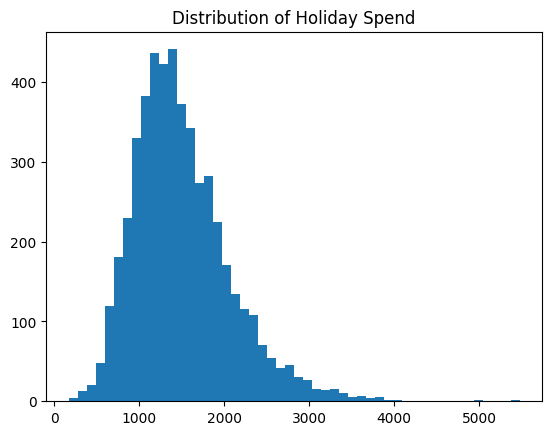
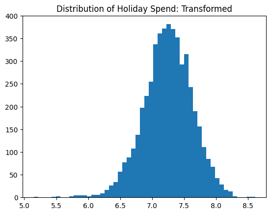
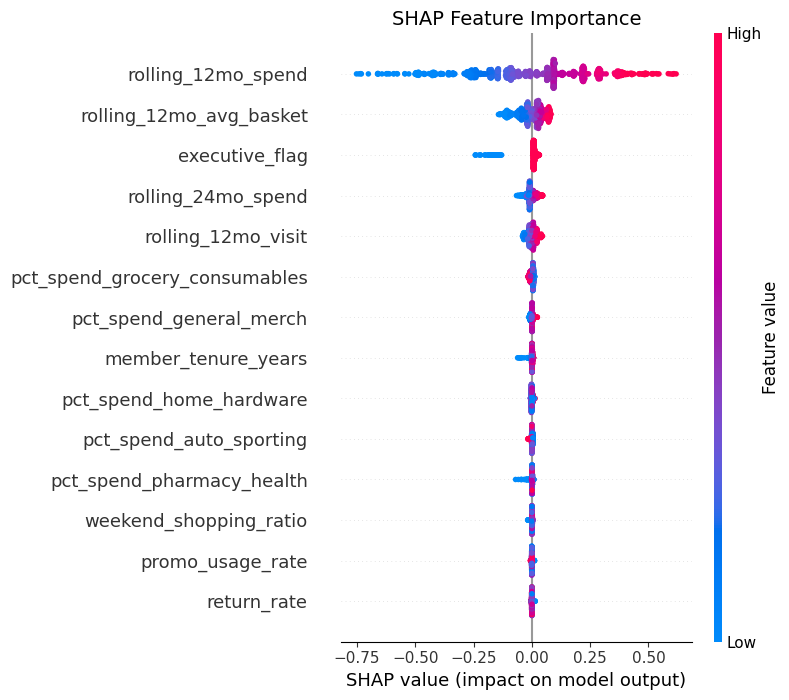

## Business Problem

### Project Goals

-   Predict how much a Costco member will spend during the Holiday season (from October to December) based on their past behaviors.

-   Asses member behavior to see which characteristics predict holiday spend best in order to support targeted promotions and inventory planning.

## Data Design

### Data Overview

-   5,000 [*Simulated*]{.underline} Costco members (rows)

-   14 behavioral and membership features (columns)

### Why Simulated Data?

-   Costco has a very strict privacy policy, and does not share member data.

-   Most simulated data takes random numbers from a Normal distribution, I wanted more control over the data design.

## Feature Engineering

-   Member behavior was simulated using appropriate statistical distributions.

    -   Tenure modeled with a **right-skewed beta distribution** to reflect high renewal rates.

    -   Spending generated with **gamma distributions** to capture skewed, positive-only purchase behavior.

    -   Visit counts modeled using **Poisson processes** (event-based behavior).

    -   Department-level spending shares generated via a **Dirichlet distribution** to ensure proportions sum to 1.

## Target Variable

-   Constructed as a nonlinear function of

    -   Prior spending, category mix, membership status (executive vs. gold star)

-   It follows a right-skewed distribution, consistent with typical retail data.

-   Applied log transformation to reduce influence of extreme spenders.

    {width="350" height="170"}{width="350" height="170"}

## Feature Correlation Analysis

::::: {style="display: flex; height: 500px; align-items: center;"}

::: {style="flex: 1.5;"}

:::

::: {style="flex: 1; padding-left: 30px; font-size: 25px;"}
-   **Highly correlated features:**\
    **rolling_12mo_spend & rolling_12mo_avg_basket: 0.83**

-   *Features retained for XGBoost, but rolling_12mo_avg_basket was removed for Multiple Linear Regression and ElasticNet*
:::
:::::

## Model Performance

-    The tree based model (XGBoost) performed slightly better than the linear models (Linear Regression & ElasticNet).

| Model             | $R^2$  | MAE      | RMSE     |
|-------------------|--------|----------|----------|
| Linear Regression | 0.6614 | \$264.66 | \$333.65 |
| ElasticNet        | 0.6625 | \$264.42 | \$333.11 |
| XGBoost           | 0.6864 | \$256.20 | \$321.07 |

## Individual Prediction Analysis

-   When the actual Holiday Spend is \$1,460.97 Each model's prediction is:

| Model             | Prediction | Error    |
|-------------------|------------|----------|
| Linear Regression | \$1,158.06 | \$302.91 |
| ElasticNet        | \$1,151.33 | \$309.63 |
| XGBoost           | \$1,190.66 | \$270.31 |

## Feature Importance 

::::: {style="display: flex; height: 500px; align-items: center;"}
::: {style="flex: 1.5;"}

:::

::: {style="flex: 1; padding-left: 30px; font-size: 30px;"}
-   Looking at the SHAP results of the directional effects for individual predictions, prior annual spending dominates predictions.
:::
:::::

## Business Takeaways

### Key Insights:

-   Spending history is the strongest predictor

-   Executive membership status also impact spending

### Recommendations:

-   Use XGBoost for holiday spend predictions.

-   Focus on members with high spend history for holiday campaigning.
